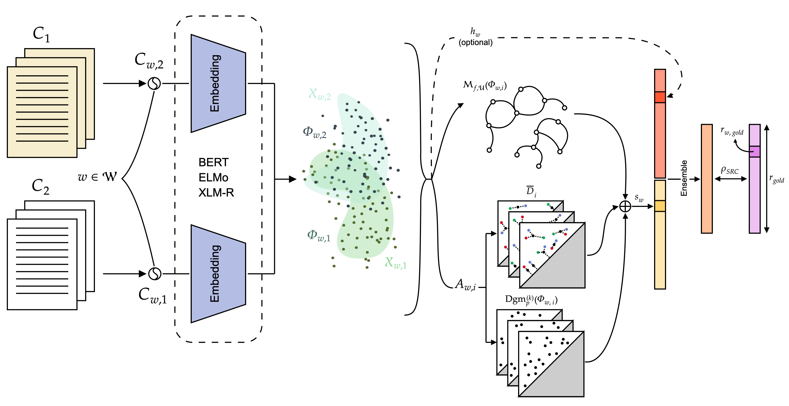

# The Shape of Words: Semantic Change Detection via TDA
**Author**: Michael Etienne Van Huffel


## Overview
This repository features the implementation of topology-based algorithms for solving the *unsupervised* Lexical Semantic Change Detection (LSCD) task introduced by [Schlechtweg et al. (2020)](https://aclanthology.org/2020.semeval-1.1.pdf). The implementation utilizes three types of pre-trained contextualized embeddings: [BERT](https://aclanthology.org/N19-1423.pdf), [ELMo](https://aclanthology.org/N18-1202.pdf), and [XLM-R](https://arxiv.org/pdf/1911.02116). This work was carried out as part of my thesis during my exchange semester at Imperial College London, in collaboration with the Turing Institute and Queen Mary University.



**Figure 1:** Overview of the pipeline of this work.


## Repository Structure

The repository is organized as follows:
- `runner.sh`: Bash script to run topological algorithms.
- `src/pha.py`: Core implementation of the **PHa** algorithm.
- `src/fma.py`: Core implementation of the **FMa** algorithm.
- `src/mra.py`: Core implementation of the **MRa** algorithm.
- `src/predict.py`: Python script to estimate semantic change for given language and set of target words.
- `src/embs/`: Contains scripts and helper functions for generating contextualized embeddings using **BERT**, **ELMo**, and **XLM-R**.
- `src/utils/`: Contains auxiliary scripts for topological algorithms. The `kcluster.py` file is the official code accompanying the paper by [Bobrowski et al. (2023)](https://www.mdpi.com/1099-4300/25/12/1587), with full credit given to the authors.


## Installation
To reproduce the analysis environment, you will need Python 3.9 or later. Please install the required Python packages listed in `requirements.txt`.

```bash
git clone git@github.com:majkevh/tda-cssd.git
cd tda-cssd
pip install -r requirements.txt
```

## Data
The datasets were too large to upload to Git, but they can be downloaded from [here](https://polybox.ethz.ch/index.php/s/ZUBow2472CY5JJJ). Please place the `data/` folder at the root of the repository before running the `runner.sh` file. The `data/` folder contains the four diachronic corpora for [English](https://www.ims.uni-stuttgart.de/en/research/resources/corpora/sem-eval-ulscd-eng/), [German](https://www.ims.uni-stuttgart.de/en/research/resources/corpora/sem-eval-ulscd-ger/), [Swedish](https://zenodo.org/record/3730550), and [Latin](https://zenodo.org/record/3734089), along with their contextualized embeddings for the target word vectors. The datasets are sourced from the respective links provided.


## Pre-trained Embeddings
**BERT**: The following pre-trained BERT models are employed:
  - For English: `google-bert/bert-base-uncased`
  - For German: `google-bert/bert-base-german-cased`
  - For Swedish: `af-ai-center/bert-large-swedish-uncased`
  - For Latin: `google-bert/bert-base-multilingual-cased`

**XLM-R**: We utilize the `FacebookAI/xlm-roberta-base` model for all languages. This model can be downloaded from Hugging Face.

**ELMo**: We use the language-specific pre-trained models for English, German, Swedish, and Latin, which can be found at [NLPL](https://github.com/HIT-SCIR/ELMoForManyLangs/tree/master?tab=readme-ov-file). After download, place the folders in the `src/embs/` folder and leave their default *id* name.

All BERT and XLM-R  pre-trained models can be downloaded from [Hugging Face website](https://huggingface.co). 

To generate the embeddings for a specific model, use the following command from the root of the repository:

```bash
python3 src/embs/generate_embeddings.py --embedding "MODEL_NAME" --language "LANGUAGE" --corpus "CORPUS"
```
For example, to generate embeddings using the BERT model for the English corpus *ccoha1*, you can run:

```bash
python3 src/embs/generate_embeddings.py --embedding "BERT" --language "english" --corpus "corpus1"
```
This command uses the default parameters for layers, batch size, layer aggregation, and other settings as described in my thesis. To modify these parameters, adjust the corresponding hyperparameters directly in the files `elmo.py`, `bert.py`, and `xlmr.py` in the `src/embs/` folder, for the ELMo, BERT, and XLM-R models, respectively. Please note that some functions within these files are inspired by the code accompanying the paper by [Kutuzov et al. (2020)](https://arxiv.org/pdf/2005.00050).

## Semantic Change Estimation
To estimate the semantic change for each language, run:

```bash
python3 src/predict.py -e "MODEL_NAME" -l "LANGUAGE" -ens "ENSEMBLE_TYPE" -a "ALGORITHM" -m "METRIC"
```

This script produces `.txt` files containing the semantic change from *corpus1* to *corpus2* for the selected language and parameters.

To download precomputed topological summaries to compute semantic change directly, please download them from [here](https://polybox.ethz.ch/index.php/s/ZUBow2472CY5JJJ).


## License
This project is licensed under the MIT License - see the [LICENSE](LICENSE) file for details.
